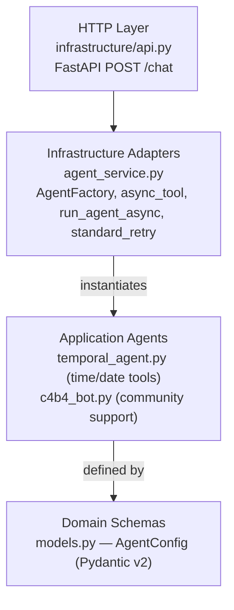
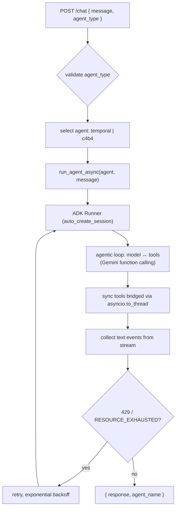

# CabaModel: Gemini-Native Agent Orchestration

<p align="center">
  
  
  
  
</p>

AI agent orchestration framework built on the **Google Agent Development Kit (ADK)**, exposed through a **FastAPI** REST interface. CabaModel decouples agent definition, execution, and infrastructure behind a hexagonal (ports & adapters) architecture, delivering a resilient, schema-validated layer for running Gemini-native agents with tool-calling loops.

The framework abstracts the ADK `Runner` execution model — event streams, tool calls, and session handling — behind a single async service contract, making specialized agents first-class, swappable components.

## 🔗 Live Demo

**[cabamodel.onrender.com/ui](https://cabamodel.onrender.com/ui)** — minimal chat interface, talk to the agents directly.
Raw API docs (Swagger) at [/docs](https://cabamodel.onrender.com/docs).

> Hosted on Render's free tier: spins down after 15 minutes idle, so the first request after a while takes ~30s to cold-start. `/chat` is rate-limited (5 requests/hour/IP) to protect the underlying Gemini API quota.

---

## Key Capabilities

- **ADK Runner Execution:** Built on the `Runner` pattern with `InMemorySessionService`, handling agentic loops, event streams, and native tool calling end-to-end.
- **Hexagonal Architecture:** Strict separation between **Domain** (`AgentConfig` schemas), **Application** (agent definitions), and **Infrastructure** (ADK adapters, HTTP layer).
- **Schema-Validated Configuration:** Agent definitions are Pydantic v2 models with enforced constraints — name length, model selection, description, instruction, and tool registration.
- **Asynchronous & Non-Blocking:** Full `asyncio` pipeline; synchronous tools are bridged via `asyncio.to_thread` to keep the event loop unblocked.
- **Resilience:** Standardized retry policy (3 attempts, exponential backoff 4–10s) around external model calls.
- **Type-Safe Tooling:** Strict mypy compliance and ruff enforcement with a 100-column line length.
- **Pluggable Agent Registry:** New agents are registered by defining an `AgentConfig` in the application layer — no infrastructure changes required.

---

## Design Decisions

- **Hexagonal Architecture (Ports & Adapters):** Domain schemas, agent definitions, and ADK infrastructure are strictly layered so the ADK SDK — or the LLM provider behind it — can be swapped without touching agent logic or the HTTP layer.
- **Pydantic v2 for Agent Configuration:** `AgentConfig` is schema-validated at definition time, not at request time. Malformed agent definitions fail at import/startup, never mid-request.
- **`asyncio.to_thread` for Sync Tool Bridging:** ADK tool functions are plain sync callables; bridging them through a thread pool keeps the single event loop unblocked instead of forcing every tool to be rewritten async.
- **Retry at the Model-Call Boundary, Not the Request Boundary:** `tenacity`-backed exponential backoff wraps only the external Gemini call, so a 429/`RESOURCE_EXHAUSTED` is retried without re-running already-completed tool calls in the same turn.
- **Pluggable Agent Registry over a Central Dispatcher:** New agents register themselves as `AgentConfig` instances in the application layer — no changes to `infrastructure/api.py` or the ADK adapter are needed to add one.

---

## Tech Stack

| Layer            | Technology                                        |
| :--------------- | :------------------------------------------------ |
| Runtime          | Python >= 3.14                                    |
| Agent Framework  | google-adk (>= 1.23.0)                            |
| LLM              | Gemini (`google-generativeai` >= 0.8.6)           |
| API Framework    | FastAPI + uvicorn                                 |
| Validation       | Pydantic v2 + pydantic-settings                   |
| Resilience       | tenacity (exponential backoff)                    |
| Config           | python-dotenv                                     |
| Tooling          | mypy (strict), ruff                               |

---

## Architecture


```mermaid
graph TD
    A["HTTP Layer<br/>infrastructure/api.py<br/>FastAPI POST /chat"] --> B
    B["Infrastructure Adapters<br/>agent_service.py<br/>AgentFactory, async_tool, run_agent_async, standard_retry"] -->|instantiates| C
    C["Application Agents<br/>temporal_agent.py (time/date tools)<br/>c4b4_bot.py (community support)"] -->|defined by| D
    D["Domain Schemas<br/>models.py — AgentConfig (Pydantic v2)"]
```

### Execution Flow


```mermaid
flowchart TD
    A["POST /chat { message, agent_type }"] --> B{"validate agent_type"}
    B --> C["select agent: temporal | c4b4"]
    C --> D["run_agent_async(agent, message)"]
    D --> E["ADK Runner (auto_create_session)"]
    E --> F["agentic loop: model ↔ tools<br/>(Gemini function calling)"]
    F --> G["sync tools bridged via asyncio.to_thread"]
    G --> H["collect text events from stream"]
    H --> I{"429 / RESOURCE_EXHAUSTED?"}
    I -->|yes| J["retry, exponential backoff"]
    J --> E
    I -->|no| K["{ response, agent_name }"]
```

### Project Structure

```text
CabaModel/
├── main.py                                # Entry point (env check + uvicorn)
├── src/cabamodel/
│   ├── domain/
│   │   └── models.py                      # AgentConfig Pydantic schema
│   ├── application/
│   │   ├── temporal_agent.py              # Time/date agent (tool-enabled)
│   │   └── c4b4_bot.py                    # Community support agent
│   └── infrastructure/
│       ├── agent_service.py               # AgentFactory, Runner, retry policy
│       └── api.py                         # FastAPI application
├── .env.example
└── pyproject.toml
```

---

## Getting Started

### Prerequisites

- Python >= 3.14
- A Google API key with access to the Gemini models

### Quickstart

```bash
git clone <REPOSITORY_URL>
cd CabaModel

python -m venv venv
# Windows
venv\Scripts\activate
# Linux/macOS
source venv/bin/activate

pip install -e .
```

Create your environment file and add your API key:

```bash
cp .env.example .env
# Set GOOGLE_API_KEY=<your_key>
```

Start the API:

```bash
python main.py
```

Interactive OpenAPI documentation is available at `http://127.0.0.1:8000/docs`.

### Programmatic Usage

The orchestration service can be used directly from Python code:

```python
from src.cabamodel.application.temporal_agent import root_agent
from src.cabamodel.infrastructure.agent_service import run_agent_async

async def main():
    response = await run_agent_async(root_agent, "What time is it now?")
    print(f"Agent Response: {response}")
```

The `run_agent_async` contract handles the tool-calling loop and event stream automatically.

---

## Configuration & Environment Variables

| Variable          | Default   | Description                                      |
| :---------------- | :-------- | :----------------------------------------------- |
| `GOOGLE_API_KEY`  | *(required)* | API key for Gemini model access. The server refuses to start without it. |
| `ADK_LOG_LEVEL`   | `INFO`    | Logging verbosity for the ADK runtime.           |

---

## API Reference

### `POST /chat`

Routes a user message to a registered agent and returns its generated response.

**Request body:**

```json
{
  "message": "What time is it now?",
  "agent_type": "temporal"
}
```

| Field        | Type   | Required | Description                                          |
| :----------- | :----- | :------- | :--------------------------------------------------- |
| `message`    | string | yes      | User prompt to dispatch to the agent.                |
| `agent_type` | string | no       | Agent selector: `"temporal"` or `"c4b4"`. Defaults to `"temporal"`. |

**Response body:**

```json
{
  "response": "It is currently 14:32:05.",
  "agent_name": "Temporal_Tool_Agent"
}
```

**Error responses:** `400` for an invalid `agent_type`; `500` for execution failures.

### `GET /`

Health probe returning service status and documentation link.

---

## Registered Agents

| Agent                  | Model                | Tools                                   | Use Case                              |
| :--------------------- | :------------------- | :-------------------------------------- | :------------------------------------ |
| `Temporal_Tool_Agent`  | `gemini-flash-latest`| `get_current_time`, `get_current_weekday` | Real-time system clock queries      |
| `C4B4_Assistant`       | `gemini-flash-latest`| —                                       | Automated community support for the C4B4 ecosystem |

---

## License

Distributed under the **Apache 2.0** License. See `LICENSE` for details.
